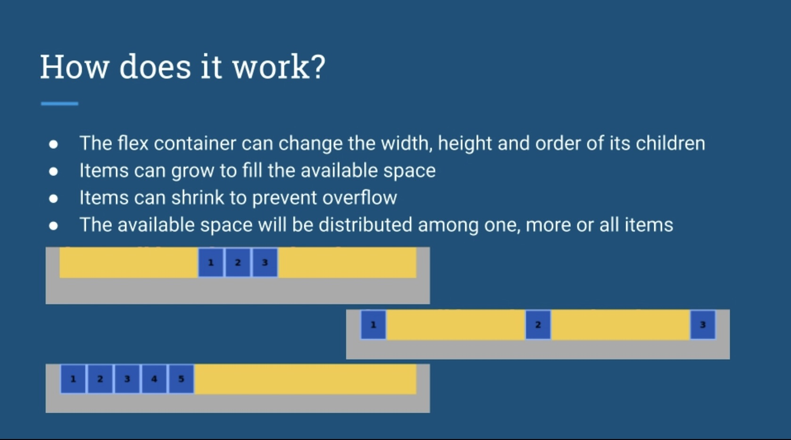
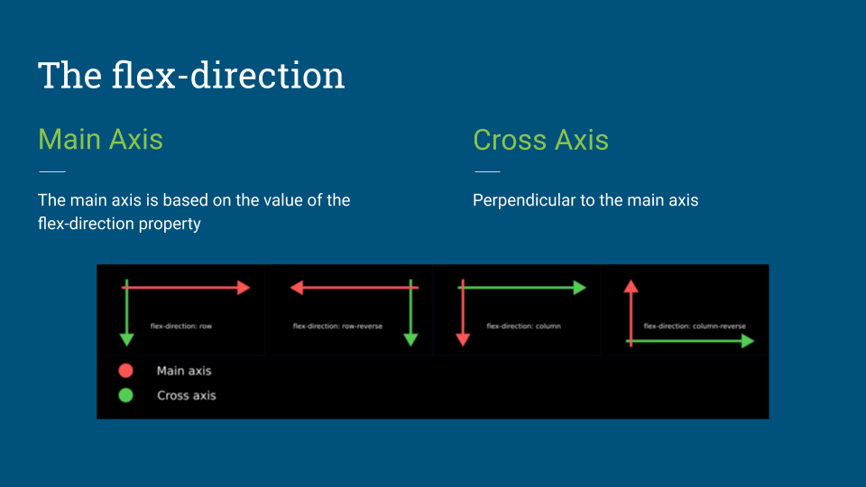
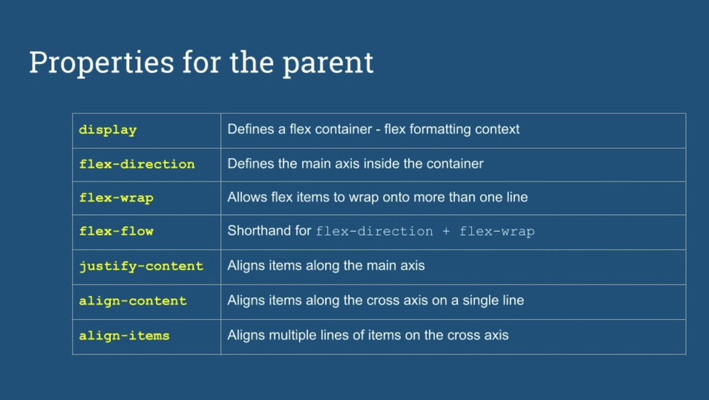

# Flexbox Explained

### Chapter 1 :

**Flexbox** : uses a parent-child relationship so when you declare a flex container, the direct children of this container will automatically turn into flex items.

* Flexbox is a one-dimensional layout model.  It can manage either columns or rows.
* CSS Grid is a two-dimensional layout model.  It can manage both column and rows.

### How does flexbox work?

* Flexbox works on a axis grid.
* Flex items can grow to fill the available space inside a container, or they can shrink to prevent overflow.

### The Flexbox Axes

A flexbox container has two axes :
* Main axis
* Cross axis

The main axis is determined by the value of the flex-direction property.  The main axis can go in these directions:
* left to right: flex-direction : row
* right to left: flex-direction : row-reverse
* top to bottom: flex-direction : column
* bottom to top: flex-direction : column-reverse

The cross axis on the other side will always be perpendicular to the main axis.

### The Flexbox properties

The flexbox module has it's own set of properties.  Some of these properties apply to the parent container while others apply to the flex items.

